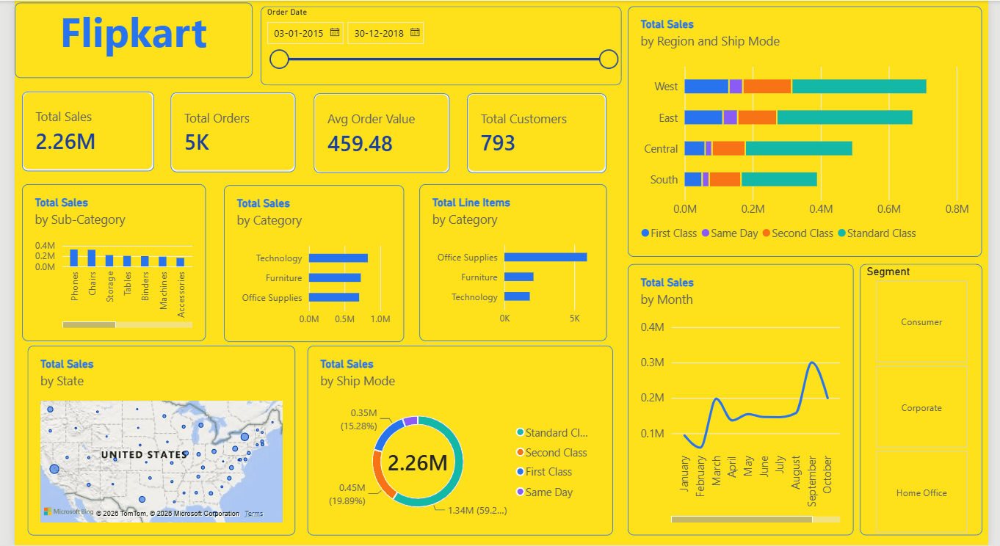

# 🛒 Flipkart E-Commerce Sales & Customer Analytics Dashboard

*Simplilearn "Power BI for Beginners" — Mini Project*

A Flipkart-branded, single-page Power BI dashboard built on the Kaggle Superstore Sales dataset.

---

## 🎯 Project Overview

Turns a raw retail sales CSV into an interactive, decision-ready dashboard — KPI cards, regional and category breakdowns, ship-mode analysis, and a monthly sales trend, without manual pivot-table analysis.

## 🛠️ Tech Stack

- **Tool:** Microsoft Power BI Desktop
- **ETL:** Power Query (M)
- **Modeling:** DAX
- **Dataset:** [Kaggle Superstore Sales Dataset](https://www.kaggle.com/datasets/rohitsahoo/sales-forecasting) — 9,800 rows, 18 columns
- **Theme:** custom yellow-and-blue JSON theme inspired by Flipkart's brand colours

## 📊 Key Metrics (DAX)

```dax
Total Sales = SUM(train[Sales])
Total Orders = DISTINCTCOUNT(train[Order ID])
Avg Order Value = DIVIDE([Total Sales], [Total Orders])
Total Customers = DISTINCTCOUNT(train[Customer ID])
Total Line Items = COUNTROWS(train)
```

## ✅ Dashboard Contents

| Visual | Fields |
|---|---|
| 4 KPI cards | Total Sales, Total Orders, Avg Order Value, Total Customers |
| Sales by Region & Ship Mode | Region, Ship Mode, Sales |
| Sales by Sub-Category | Sub-Category, Sales |
| Sales by Category | Category, Sales |
| Line Items by Category | Category, row count |
| Sales by Ship Mode | Ship Mode, Sales (donut) |
| Sales by State | State, Sales (map) |
| Sales by Month | Order Date, Sales (trend line) |
| Segment filter | Segment (button slicer) |
| Order Date filter | Order Date (range slider) |

## 📝 Notes

- **Line Items by Category** counts product rows, not literal units sold — `train.csv` has no quantity field, so row count is used as the closest available proxy.

## 🚀 How to Reproduce

1. Open `Flipkart_Sales_Dashboard.pbix` in Power BI Desktop.
2. Data source is `train.csv` (Kaggle Superstore Sales dataset) — if Power BI asks you to locate it, point it to the copy in this repo.
3. All five DAX measures are defined on the `train` table under Modeling > New measure.
4. Visuals are built directly on `train` columns — no transformations beyond basic data-type fixes in Power Query.
5. Theme: apply a custom JSON theme (background `#FFD200`, accent `#2874F0`) via View > Themes > Browse for themes.

## 🖼️ Dashboard Screenshot


## 🎬 Interaction Demo



## 📄 Project Report

Full write-up covering approach, DAX measures, and testing: [Flipkart_Sales_Dashboard_Report.docx](Flipkart_Sales_Dashboard_Report.docx) · [PDF version](Flipkart_Sales_Dashboard_Report.pdf)

## 🎓 Certificate

- [Power BI for Beginners — Simplilearn](PowerBI_for_Beginners_Certificate.pdf)

## 📁 Files in This Repo

| File | Description |
|---|---|
| `Flipkart_Sales_Dashboard.pbix` | The Power BI project file |
| `final_dashboard.webp` | Dashboard screenshot |
| `dashboarddd.gif` | Interaction demo |
| `Flipkart_Sales_Dashboard_Report.pdf` / `.docx` | Full mini project report |
| `Flipkart_Sales_Dashboard_Presentation.pptx` | Project presentation slides |
| `PowerBI_for_Beginners_Certificate.pdf` | Course completion certificate |
| `train.csv` | Source dataset |

---

*Built by Abhishek Rawat as part of the Simplilearn "Power BI for Beginners" course.*
