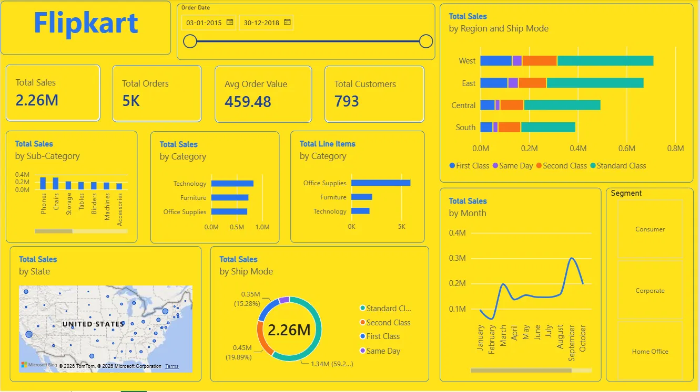

# Flipkart E-Commerce Sales & Customer Analytics Dashboard

A Flipkart-branded, single-page Power BI dashboard built on the Kaggle Superstore Sales dataset — created for the Simplilearn "Power BI for Beginners" mini project (B.Tech CSE, Uttaranchal University).



## Overview

- **Objective:** turn a raw retail sales CSV into an interactive, decision-ready dashboard without manual pivot-table analysis.
- **Tool:** Microsoft Power BI Desktop (Power Query + DAX).
- **Dataset:** [Kaggle Superstore Sales Dataset](https://www.kaggle.com/datasets/rohitsahoo/sales-forecasting) — 9,800 rows, 18 columns.
- **Theme:** custom yellow-and-blue palette inspired by Flipkart's brand colours.
- **Data integrity:** every KPI, chart, and slicer is built strictly from real columns in `train.csv` — no simulated fields.

## Key metrics (DAX)

```dax
Total Sales = SUM(train[Sales])
Total Orders = DISTINCTCOUNT(train[Order ID])
Avg Order Value = DIVIDE([Total Sales], [Total Orders])
Total Customers = DISTINCTCOUNT(train[Customer ID])
Total Line Items = COUNTROWS(train)
```

## Notes

- **Line Items by Category** counts product rows, not literal units sold — `train.csv` has no quantity field, so row count is used as the closest available proxy.

## How to reproduce

1. Open `Flipkart_Sales_Dashboard.pbix` in Power BI Desktop.
2. The data source is `train.csv` (Kaggle Superstore Sales dataset) — if Power BI asks you to locate it, point it to the copy in this repo.
3. All five DAX measures (Total Sales, Total Orders, Avg Order Value, Total Customers, Total Line Items) are defined on the `train` table under Modeling > New measure.
4. Visuals are built directly on `train` columns — no transformations beyond basic data-type fixes in Power Query.
5. Theme: apply a custom JSON theme (background `#FFD200`, accent `#2874F0`) via View > Themes > Browse for themes.

## Dashboard contents

| Visual | Fields |
|---|---|
| 4 KPI cards | Total Sales, Total Orders, Avg Order Value, Total Customers |
| Sales by Region & Ship Mode | Region, Ship Mode, Sales |
| Sales by Sub-Category | Sub-Category, Sales |
| Sales by Category | Category, Sales |
| Line Items by Category | Category, row count |
| Sales by Ship Mode | Ship Mode, Sales (donut) |
| Sales by State | State, Sales (map) |
| Sales by Month | Order Date, Sales (trend line) |
| Segment filter | Segment (button slicer) |
| Order Date filter | Order Date (range slider) |

## Files in this repo

| File | Description |
|---|---|
| `Flipkart_Sales_Dashboard.pbix` | The Power BI project file — open in Power BI Desktop |
| `final_dashboard.png` | Screenshot of the finished dashboard |
| `Flipkart_Sales_Dashboard_Report.pdf` / `.docx` | Full mini project report |
| `Flipkart_Sales_Dashboard_Presentation.pptx` | Project presentation slides |
| `PowerBI_for_Beginners_Certificate.pdf` | Simplilearn course completion certificate |
| `train.csv` | Source dataset (Kaggle Superstore Sales) |

## Author

**Abhishek Rawat** — B.Tech CSE, Uttaranchal Institute of Technology, Uttaranchal University
Roll No. 2401010038 | Faculty Coordinator: Mr. Arpit Goel

## Acknowledgements

- [Simplilearn](https://www.simplilearn.com/) — "Power BI for Beginners" course
- [Kaggle](https://www.kaggle.com/) — Superstore Sales Dataset (R. Sahoo)
